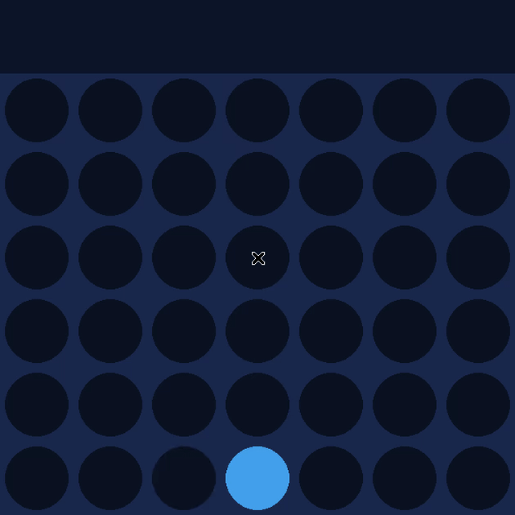

# Heroes vs Villains Connect Four

A "Connect Four with AI" backlog item reskinned as UA Heroes vs the
League of Villains: drop hero-blue discs against an AI playing purple
villain discs, powered by minimax with alpha-beta pruning.



## Features

- Full Connect Four rules (drop-by-gravity, horizontal/vertical/diagonal
  win detection) implemented from scratch and kept entirely separate from
  the pygame front-end, so the rules and the AI are unit tested without a
  display
- Minimax with alpha-beta pruning: the AI takes an immediate winning move
  when one exists, blocks an immediate opponent win, and correctly
  prioritizes winning now over addressing an unrelated future threat
- A small opening-variety rule (random among center-weighted columns on a
  completely empty board) so the AI doesn't play the identical first move
  every game, without touching the minimax correctness itself
- Restart (`R`) and quit (`Q`) in the interactive window

## Tech Stack

Python 3 · `pygame-ce`

## Getting Started

```bash
git clone https://github.com/Kazenubis/heroes-vs-villains-connect-four.git
cd heroes-vs-villains-connect-four
pip install -r requirements.txt
python3 main.py
```

Click a column to drop a piece. `R` restarts, `Q` quits.

Run the tests (no display needed):

```bash
python3 -m unittest test_connect_four.py -v
```

## What I Learned

My first version of the AI picked randomly among "tied" best moves for
opening variety — and it had a real bug hiding behind that randomness: a
pruned alpha-beta branch's returned score is only a *bound*, not
necessarily that branch's true value, since pruning means the search
stopped early specifically because it proved the branch couldn't beat
what's already found. Treating a pruned bound as tied with a genuinely
computed best score let the AI occasionally pick a strictly worse column
that only *looked* equally good on paper — confirmed by a test where the
AI had an immediate winning move available and instead picked an
unrelated column, purely due to how the tie was resolved. The fix was to
use strict comparison only when selecting the best move, and move the
opening-variety randomness to its own explicit empty-board case instead
of leaning on minimax tie-breaking.
